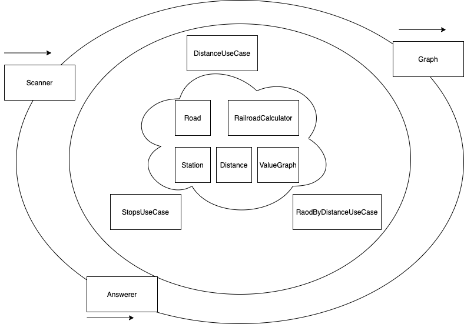
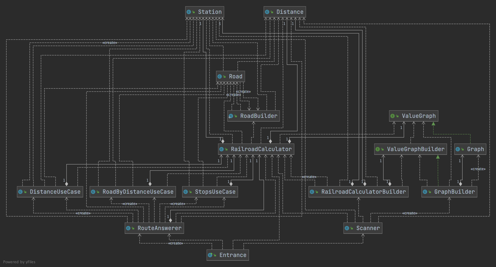

# TW Assignment - Trains

## How to
0. Requirement
```
JDK 14
```
1. Run
```shell
shell> `./gradlew run`
```
Execute whole project to show inputs and outputs.

2. Test
```shell
shell> `./gradlew test`
```
Run all tests.

## Design


1. Core concepts
- *RailroadCalculator*: Can be initialized by road graph, provide ability to calculate possible *Roads* between stations.
- *Road*: Define a specific road that contains two or more *Stations*, and the *Distance* between each node.
- *ValueGraph* & *ValueGraphBuilder*: Define a graph that has some nodes, and the connection between two nodes contains weight as value.  

2. Adapters
- *Scanner*: Analyze *Station* and *Distance* from given string, then build *RailroadCalculator*.
- *RouteAnswerer*: Provide four types of problems that can be calculated by *RailroadCalculator*.
- *Graph* & *GraphBuilder*: An implementation of *ValueGraph* & *ValueGraphBuilder*.

3. Use case
- *DistanceUseCase*: Calculate the directly *Distance* between two *Stations*.
- *RoadByDistanceUseCase*: Calculate the *Roads* that meet the given *Distance*.
- *StopsUseCase*: Calculate the *Roads* that meet the given stops count.

**Major class relationship diagram:**
